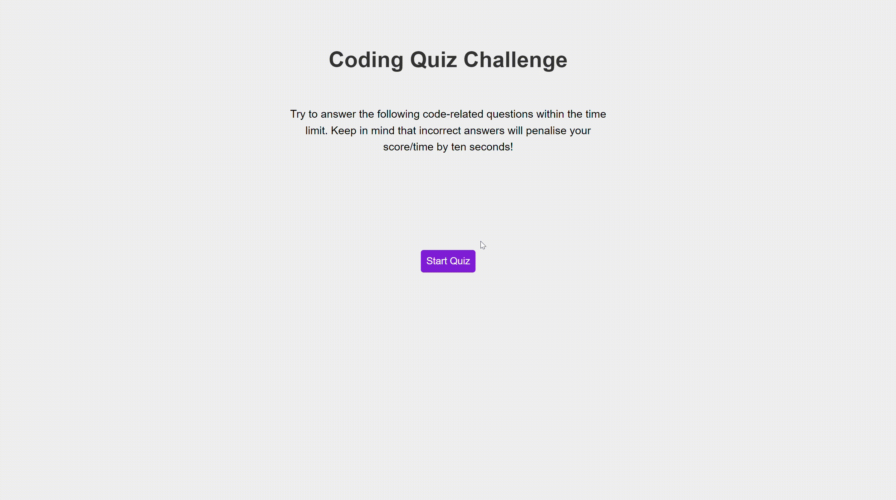

# 04 Web APIs: Code Quiz

## Module 04 Challenge

Since this is an even-numbered week, I won't be given any starter code. Instead, I'll have to create a web application from scratch!

## The Task

At some point in my journey to become a full-stack web developer, I’ll likely be asked to complete a coding assessment&mdash;perhaps as part of an interview process. A typical coding assessment includes both multiple-choice questions and interactive coding challenges. 

To help familiarize myself with these tests and allow me to use the skills covered in this module, this Challenge invites me to build a timed coding quiz with multiple-choice questions. This app will run in the browser and will feature dynamically updated HTML and CSS powered by JavaScript code that I write. It will have a clean, polished, and responsive user interface. 

This week’s coursework will equip me with all the skills I need to succeed in this assignment.

## User Story

```
AS A coding boot camp student
I WANT to take a timed quiz on JavaScript fundamentals that stores high scores
SO THAT I can gauge my progress compared to my peers
```

## Acceptance Criteria

```
GIVEN I am taking a code quiz
WHEN I click the start button
THEN a timer starts and I am presented with a question
WHEN I answer a question
THEN I am presented with another question
WHEN I answer a question incorrectly
THEN time is subtracted from the clock
WHEN all questions are answered or the timer reaches 0
THEN the game is over
WHEN the game is over
THEN I can save my initials and my score
```

## Mock-Up

The following animation demonstrates the application functionality:




## Notes

* [Click here for the URL of the deployed application.](https://badrulborhanudin.github.io/coding-quiz-app)

* [Click here for the URL of the GitHub repository, with a unique name and a README that describes this project.](https://github.com/BadrulBorhanudin/coding-quiz-app)
